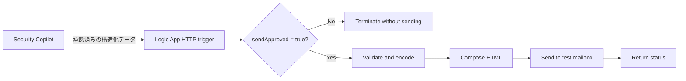

# Lab 7: Logic Apps で HTML/CSS レポートを通知する

**所要時間:** 30 分  
**ゴール:** Security Copilot の分析と外部通知を分離し、明示的な承認後だけテスト用 HTML メールを送る

## こんなケースはありませんか

> 「調査結果をマネージャーや関係部署へ共有するために、毎回手でメール本文を作って体裁を整えている」——カスタムエージェント自体はメール送信などの外部通知機能を持たないため、共有のひと手間が残ります。

Logic Apps を組み合わせると、**Security Copilot の分析結果を、承認を経てから HTML/CSS の見やすいレポートとして自動送信できる**ようになります。分析と通知を分けることで、意図しない送信を防ぎながら報告作成を自動化できます。

> [!NOTE]
> この Lab は少し手順が多めですが、あせらなくて大丈夫です。ポイントは「**分析する AI** と「**メールを送る仕組み**」を分けて、人が OK したときだけ送る」という考え方です。まずは送信しないテストから始めます。

## 7-1. アーキテクチャを理解する



カスタムエージェントの分析ロジックと、メール送信という処理を分けます。エージェントの出力を無条件に送信しません。

## 7-2. Logic App を作る

1. Azure portal で演習用リソースグループを選びます。
2. **Logic App (Consumption)** を作成します。
3. Designer で **When an HTTP request is received** トリガーを追加します。


4. Request Body JSON Schema に次を設定します。

```json
{
  "type": "object",
  "properties": {
    "sendApproved": { "type": "boolean" },
    "incidentNumber": { "type": "string", "maxLength": 32 },
    "title": { "type": "string", "maxLength": 200 },
    "severity": { "type": "string", "enum": ["Informational", "Low", "Medium", "High"] },
    "summary": { "type": "string", "maxLength": 4000 },
    "nextActions": { "type": "string", "maxLength": 2000 }
  },
  "required": ["sendApproved", "incidentNumber", "title", "severity", "summary"]
}
```


5. Condition を追加し、`sendApproved` が `true` の場合だけ後続処理へ進めます。
6. false 側は **Terminate** で `Cancelled` を返します。
7. true 側で入力の長さと値を再確認します。


## 7-3. HTML/CSS レポートを組み立てる

[report-template.html](../samples/report-template.html) をデザインの開始例として使います。

1. true 側で **Compose** アクションを追加します。
2. テンプレートのプレースホルダーへ Designer の動的コンテンツを割り当てます。


3. `summary` や `nextActions` を HTML として実行せず、`&`, `<`, `>` をエスケープしたプレーンテキストとして扱います。
4. 外部 JavaScript、外部画像、追跡ピクセルを追加しません。
5. メールの送信 (V2) アクション (Office 365 Outlook) を追加します。
6. メールコネクタの宛先を講師指定のテスト用メールボックスに固定します。
7. Subject は `[Workshop][<severity>] Sentinel incident <incidentNumber>` とします。
8. Body には Compose アクションの Outputs (出力) を設定します。


> [!CAUTION]
> 受講者が宛先を自由入力できる設計にしないでください。演習中は配布リストや実運用宛先を使いません。

## 7-4. Security Copilot スキルを作る

[logicapp-report-plugin.yaml](../samples/logicapp-report-plugin.yaml) をコピーし、Security Copilot のカスタムプラグインとしてアップロードします。
アップロード時に、設定項目として次を入力します。

- Azure subscription ID
- Resource group
- Logic App workflow name
- HTTP trigger name


これらを設定値にすることで、リポジトリへ環境固有 ID を直接書かずに済みます。Logic App と Security Copilot は同じテナントに存在する必要があります。


## 7-5. 送信前確認をテストする

最初に `sendApproved: false` で実行します。

```text
Send Incident Workshop Report スキルを使い、sendApproved は false のまま、演習インシデントのレポート送信を試してください。
```

**期待結果:** Logic App の実行は記録されますが、メールは送信されません。

次に、内容と宛先を人が確認した後だけ `sendApproved: true` で実行します。

```text
送信先が講師指定のテストメールボックスであることを確認しました。
Send Incident Workshop Report スキルを使い、sendApproved=true で次の演習データを送信してください: <サニタイズ済みデータ>
```

> [!TIP]
> **画面ショット差し替え枠 `SS-11`:** Logic App 実行履歴の成功画面。入力/出力本文と URL はマスクします。


## 7-6. 運用設計を確認する

- 最小権限の接続を使い、可能なコネクタではマネージド ID を優先する
- Logic App の実行履歴に機密データが残る前提でアクセスと保持を管理する
- 失敗、429、コネクタ認証切れを監視する
- 再試行でメールが重複しないよう、インシデント番号と実行 ID で冪等性を検討する
- 利用後は演習用 Logic App、接続、テストデータを削除する

## チェックポイント

- [ ] 分析と通知の責務を分離した
- [ ] `sendApproved=false` でメールが送られないことを確認した
- [ ] 入力を検証し、HTML として無条件に解釈しない
- [ ] テスト宛先だけへ送信した
- [ ] 実行履歴とクリーンアップ対象を確認した
